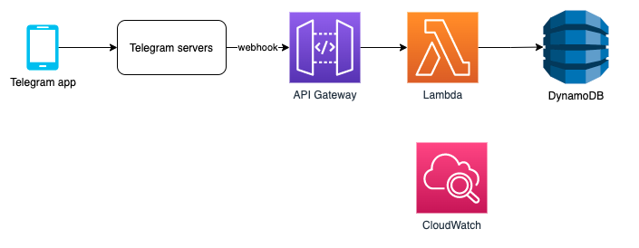

# TelegramTasweerBot
Telegram Bot that detects and deletes representations of animate objects. It could be used to remove personally identifiable information (PII) from telegram.
Its written in python 3, using the [python-telegram-bot](https://pypi.org/project/python-telegram-bot/) telegram bot framework. It runs on AWS Lambda, or as a standalone python program.

Read my [blog post](https://hacksaw.co.za/blog/running-a-telegram-bot-on-aws-lambda/).

# Architecture
Requests come in via the Lambda URL endpoint, which get routed to a Lambda function. The Lambda function gets the Telegram Token from SSM Parameter Store. Logs are stored on CloudWatch. The CI/CD pipeline will provision both a dev and prod environment.

# Islamic ruling regarding photography
Representations of animate objects are impermissible in Islam. This Bot can be used in your Telegram groups and channels to remove pictures and videos of animate objects.
The following list contains information from reliable and authentic Ulema regarding photography:
- [Is photos permissible in any madhab?](http://muftionline.co.za/node/2245)
- [Photography & Modern Challenges](http://alhaadi.org.za/articles-publications/books/60-taleemuddeen-publications/1966-photography-a-modern-challenges.html)
- [The Orchards of Love – Part Ten](https://ihyaauddeen.co.za/?p=16922)
- [Joint Statement regarding the viewing and usage of TV for propagation purposes](https://sites.google.com/site/duzakpdfs/duzakpdfs/Join_Statement_regarding_TV.pdf?attredirects=0&d=1)
- [Letter pertaining to the television Issue](https://sites.google.com/site/duzakpdfs/duzakpdfs/letter%20pertaining%20to%20the%20television%20Issue.pdf?attredirects=0&d=1)
- [Evil Effects of Television](https://www.dua.org.za/content/evil-effects-television)
- [Television - Root of Many Evil](https://www.dua.org.za/content/television-root-many-evils)
- [2014 - Announcement regarding Photography](https://ia802506.us.archive.org/7/items/Madraasah_Taaleemuddeen_Jalsa_2014/03_Important_Anouncemnet_Regarding_Photography.mp3)
- [2015 - Announcement regarding Photography](https://ia800507.us.archive.org/3/items/Madrasah_Taleemuddeen_Jalsa_2015/03_Important_Anouncement_Regarding_Photography.mp3)
- [2016 - Announcement regarding Photography](https://ia800408.us.archive.org/21/items/Madrasah_Taleemuddeen_Jalsa_2016/03_Important_Announcement.mp3)
- [2017 - Announcement regarding Photography](https://ia801602.us.archive.org/35/items/Madrasah_Taleemuddeen_Jalsa_2017/04_Important_Announcement.mp3)
- [2018 - Announcement regarding Photography](https://ia803107.us.archive.org/24/items/Madrasah_Taleemuddeen_Jalsa_2018/03_Important_Announcement.mp3)
- [2019 - Announcement regarding Photography](https://ia803006.us.archive.org/35/items/Madrasah_Taleemudden_Jalsah_2019/03_Important_Announcement_Ml_Ismail_Bayat.mp3)
- [2021 - Announcement regarding Photography](https://ia801507.us.archive.org/11/items/madrasah_taleemudden_jalsah_2021/08_Important_Announcement.mp3)
- [Wifaq ul Ulema SA - Photography](docs/Photography%20-%20Wifaqul%20Ulama%20SA.jpg)
- [Wifaqul Madaaris - Announcement](docs/Photography%20announcement-3.pdf)
- [Using Emojis](http://muftionline.co.za/node/32294)

It detects these types of objects in a telegram channel/group:
## Images
It uses AWS Rekognition to detect faces in an image, and then deletes it. This bot now uses https://aws.amazon.com/blogs/compute/creating-a-serverless-face-blurring-service-for-photos-in-amazon-s3/ to obscure/blur the faces in the images, and posts the modified image back to Telegram

## Videos
Once the filter picks up a video, it deletes it.

## Emojis
Emojis are part of telegram text messages, but we did'nt want the bot to access all messages, so we used a Telegram Message Handler with a regex to catch only blacklisted emojis. This ensures that that the bot does not access most messages, and lowers the amount of times Telegram will invoke the bot (which will also keep the cost of running the bot low). The bot uses a blacklist/blocklist of emojis that are to be removed. Only messages with those emojis will be sent to the bot, which will replace the emoji image with its text short code, which is sometimes called [CLDR](http://cldr.unicode.org/translation/characters-emoji-symbols/short-names-and-keywords). E.g. a smiling face emoji will be replaced by `:grinning_face_with_big_eyes:`. It does it as follows: a handler with a blocklist is used to catch haraam emojis, deletes the message, then the [python emoji library](https://github.com/carpedm20/emoji) is used, by calling the `demojize` method on the message, which replaces emojis in the text message with their text representation, and the bot then reposts the modified message back. However, this can be seen as intrusive, as the now modified message appears as sent from the bot, and not original person that sent the message. So therefore you want to minimise the blocklist to ONLY include haraam emojis.
[Emojipedia](https://emojipedia.org/folded-hands-light-skin-tone/), the [Unicode emoji list](https://unicode.org/emoji/charts/full-emoji-list.html) and [Emojibase](https://www.emojibase.com/) are usefull resources to check emoji and its corresponding details. At the moment, the blocklist includes only the [U1F600 range](https://unicode.org/charts/PDF/U1F600.pdf), which is the most commonly used emojis, but it exludes the last few characters, so as to not block the hands emoji. The intention currently is not be an exhaustive blocklist of every haraam emoji. This bot uses a blocklist regex to catch emojis, but you could modify it to block all emojis, and exclude certain allowed ones with a [regex not operator](https://stackoverflow.com/questions/7317043/regex-not-operator), but the negative lookahead did not work with the Telegram filter.  It would be usefull if you could simply block emojis by these [categories](https://github.com/shanraisshan/EmojiCodeSheet).
Other usefull resouces is [this](https://stackoverflow.com/questions/31430587/how-to-send-emoji-with-telegram-bot-api) and [this](https://stackoverflow.com/questions/24840667/what-is-the-regex-to-extract-all-the-emojis-from-a-string), as well as this [regex tester](https://www.regextester.com/106421). 

# Privacy
This bot only has handlers for video and images, and a limited regex for emoji, so it does not have access to most Telegram messages.

# How to run it
- Create your bot using [BotFather](https://core.telegram.org/bots#3-how-do-i-create-a-bot), and note the token, e.g. `12334342:ABCD124324234`
- Add the bot to your groups/channels, then make it an Admin to manage PII in your channels/groups
- Decide between running it on AWS Lambda, or as a standalone python script

## AWS Serverless
Once you have forked this repo, GitHub Actions CI/CD pipeline will run on a `git push`. But if you want to build and deploy from SAM, then follow this:

- Install [AWS CLI](https://docs.aws.amazon.com/cli/latest/userguide/install-cliv2.html), and  [configure it](https://docs.aws.amazon.com/cli/latest/userguide/cli-configure-quickstart.html#cli-configure-quickstart-config)
- Install [AWS SAM CLI](https://docs.aws.amazon.com/serverless-application-model/latest/developerguide/serverless-sam-cli-install.html)
- Create an SSM Parameter to store the Telegram token. `aws ssm put-parameter --region eu-west-1 --name "/telegramtasweerbot/telegram/dev/bot_token" --type "SecureString" --value "12334342:ABCD12432423" --overwrite`
- Run `sam build && sam deploy --parameter-overrides --parameter-overrides StageEnv=dev` to run it for dev. Similiar for prod.
- Note the Outputs from the above `sam deploy` command, which will include the Value of the TelegramApi, which is the Lambda URL endpoint, e.g. `https://1fgfgfd56.lambda-url.eu-west-1.on.aws/` 
- Update your Telegram bot to change from polling to [Webhook](https://core.telegram.org/bots/api#setwebhook), by pasting this URL in your browser, or curl'ing it: `https://api.telegram.org/bot12334342:ABCD124324234/setWebHook?url=https://1fgfgfd56.lambda-url.eu-west-1.on.aws/`. Use your bot token and Lambda URL endpoint. You can check that it was set correctly by going to `https://api.telegram.org/bot12334342:ABCD124324234/getWebhookInfo`, which should include the `url` of your Lambda URL, as well as any errors Telegram is encounterting calling your bot on that API.

## Standalone python script
- It picks up your telegram bot token from environment variables. E.g. running `export TELEGRAM_BOT=12334342:ABCD124324234` on Linux/macos should be sufficient. AWS credentials also picked up from environment variables.
- Install the python requirements with pip, and then run it with python, e.g `python3 TelegramPrivacyBot.py &`

# TODO: 
- Dont save image to file: https://stackoverflow.com/questions/59876271/how-to-process-images-from-telegram-bot-without-saving-to-file
- Detect cartoon images
- Filter and detect a list of URLs, e.g youtube.com
- Analyse inline images that accompany URLs/links

# Other AWS Options
1. [Image Moderation Chatbot](https://serverlessrepo.aws.amazon.com/applications/arn:aws:serverlessrepo:us-east-1:426111819794:applications~image-moderation-chatbot)
2. [Serverless Image Handler](https://aws.amazon.com/about-aws/whats-new/2021/02/introducing-serverless-image-handler-v5-2/)

